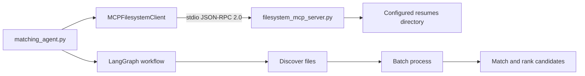

# MCP Resume Matching System

A resume matching project demonstrating the Model Context Protocol (MCP). The filesystem is exposed through a local MCP server, while the matching workflow connects to that server through an MCP client and processes candidates with LangGraph.

## Assignment Coverage

### Part A: MCP Server

`filesystem_mcp_server.py` provides:

- JSON-RPC 2.0 MCP communication over stdio using the MCP SDK
- Tool discovery and invocation
- Resource discovery and resource templates
- Safe filesystem access restricted to the configured resume directory
- `list_files`: list resume files with optional extension filtering
- `read_file`: read UTF-8 text files
- `get_file_metadata`: return file metadata and SHA-256 hash
- `batch_process`: process multiple resume files in one request
- `watch_directory`: detect newly created supported resume files
- Configuration exposed through `filesystem://config`
- Structured MCP errors for missing files, invalid paths, and invalid directories

### Part B: Agent Refactoring

`matching_agent.py` uses a LangGraph workflow:

1. Discover resume files through the MCP client
2. Batch-process resume contents through the MCP server
3. Match candidates against the job description
4. Sort candidates by score

The agent does not directly read resume files. Filesystem access is owned by the MCP server.

## Architecture



## Project Structure

```text
config.py                  Environment-based configuration
filesystem_mcp_server.py  MCP filesystem server and tools/resources
mcp_client.py              MCP stdio client wrapper
matching_agent.py          LangGraph resume matching workflow
test_watch.py              Directory watcher demonstration
requirements.txt           Python dependencies
resumes/                   Sample resume files
tests/                     MCP and agent acceptance tests
```

## Setup

Use Python 3.10 or newer. From the project directory, install dependencies:

```bash
python -m pip install -r requirements.txt
```

On Windows, activate the existing virtual environment if needed:

```bash
.venv\Scripts\activate
```

## Run the Demos

Show MCP tool and resource discovery:

```bash
python mcp_client.py
```

Run the end-to-end LangGraph matching workflow:

```bash
python matching_agent.py
```

Run the directory watcher demonstration. It creates a unique temporary demo resume and reports the creation event:

```bash
python test_watch.py
```

Run the complete acceptance test suite:

```bash
python -m pytest -q
```

Validate Python syntax:

```bash
python -m compileall -q .
```

## Configuration

Configuration is controlled by environment variables. Defaults are suitable for local execution.

| Variable | Default | Description |
| --- | --- | --- |
| `RESUME_DIRECTORY` | `./resumes` | Directory exposed by the MCP server |
| `WATCH_INTERVAL` | `1.0` | Watcher polling interval in seconds |
| `MAX_BATCH_FILES` | `50` | Maximum files accepted by `batch_process` |

Example on Windows Command Prompt:

```bat
set RESUME_DIRECTORY=C:\path\to\resumes
set WATCH_INTERVAL=0.5
python matching_agent.py
```

Example on PowerShell:

```powershell
$env:RESUME_DIRECTORY = "C:\path\to\resumes"
$env:WATCH_INTERVAL = "0.5"
python matching_agent.py
```

## Acceptance Tests

The tests cover:

- File listing through MCP
- Batch processing through MCP
- Static resource discovery
- Resource template discovery
- File metadata and SHA-256 hashing
- Path traversal rejection
- Missing file error handling
- New resume detection with `watch_directory`
- End-to-end agent execution through the MCP stdio client and LangGraph workflow

Expected result:

```text
7 passed
```

## Demo Video Sequence

1. Install dependencies with `python -m pip install -r requirements.txt`.
2. Run `python mcp_client.py` and show the discovered tools and resources.
3. Explain that the agent communicates with the server over stdio using MCP JSON-RPC.
4. Run `python matching_agent.py` and show the ranked candidates.
5. Explain the LangGraph nodes: discover, batch process, and match.
6. Run `python test_watch.py` and show the newly created resume event.
7. Run `python -m pytest -q` and show the passing acceptance tests.

## Scope Note

The optional bonus integration with an additional MCP server, such as web search or a database, is not included. The core filesystem MCP server and agent refactoring requirements are implemented.
